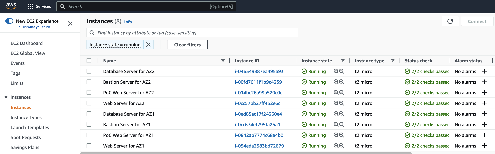
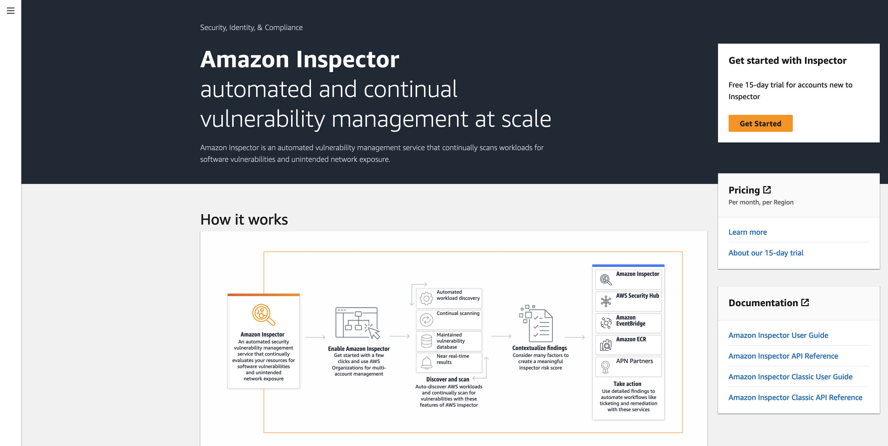

Module 2 - Running Inspector
=======================================

In the previous module you created the workshop's environment including EC2 instances running various applications. In this module you will gather the information from the CloudFormation Stack and use it to validate those services are running, run Inspector and detect Network Reachability findings.

Amazon Inspector continually scans AWS workloads for software vulnerabilities and unintended network exposure. By end of 2021 Amazon Inspector has been completely rearchitected to automate vulnerability management and deliver near real-time findings to minimize the time to discover new vulnerabilities. 

Running Inspector
============================

1.  Refresh the CloudFormation interface until the Status shows “Create Complete”

	

2.  Click on the Stack Name

3.  Go to the Outputs tab of the Stack

	

4.  Copy the DNS names from the Output frame into a text editor window. You can use these to validate the Web servers that should be publically accessible are.

    1.  The LoadBalancerFullDNS and PoCWebServer1PublicDNS should work.

    2.  PoCWebServer2PublicDNS should time out.

5.  Copy the instance ID’s from the Output frame into a text editor window. These will help you when you review the Inspector report.

6.  Go to the EC2 console to validate the instances are running.

	

7.  Go to the Inspector console.

	Next click on _Get Started_ to activate Amazon Inspector for your account. Then click on _Activate Inspector_.

	

	Activating Inspector will automatically trigger the first scan of your environment which can take a couple of minutes.

8.	You can check the Dashboard for the environment coverage. Wait until your instances are covered at 75%.

__Do you have an idea why the we only have 75% of coverage for EC2 instances?__

Next let us evaluate the [Findings](03-evaluate-findings.md).