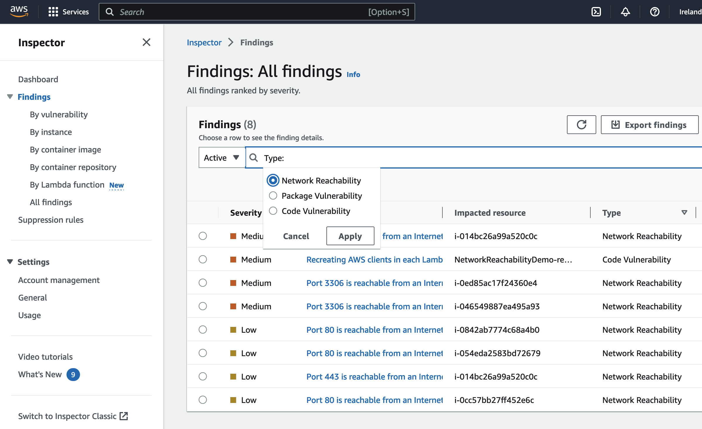
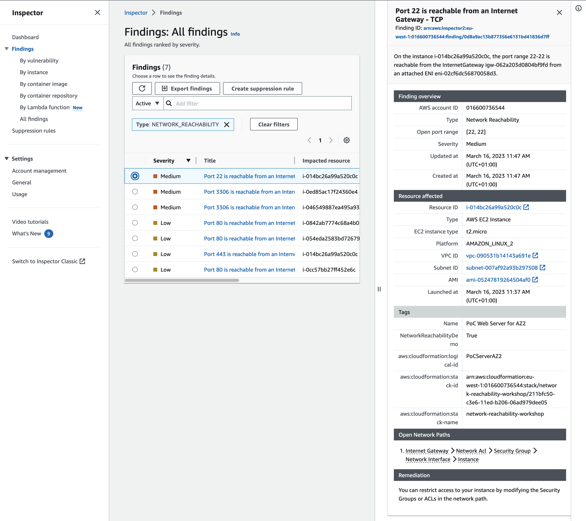
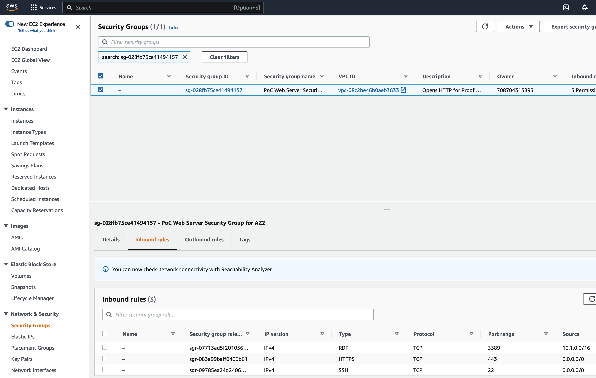
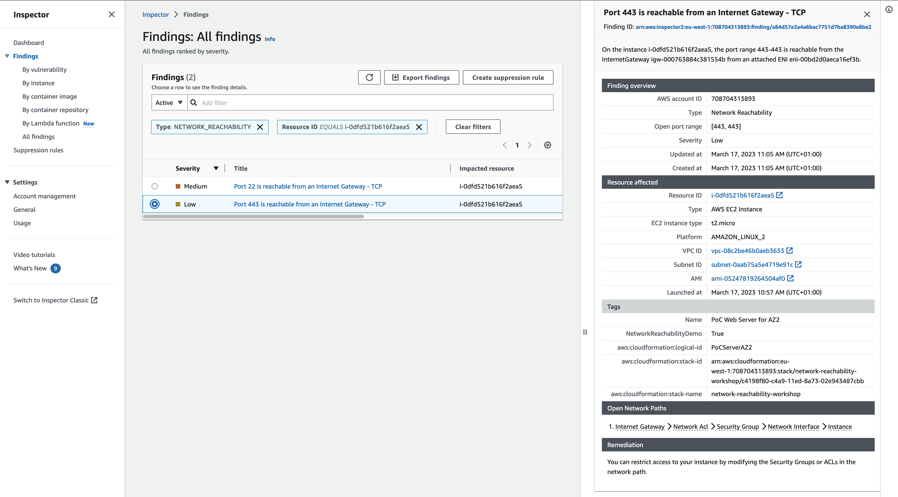
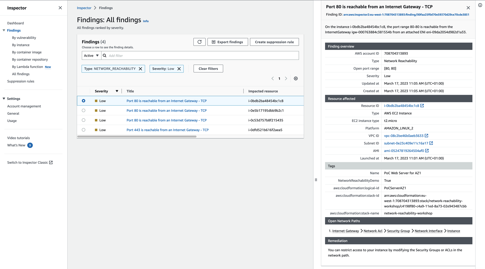
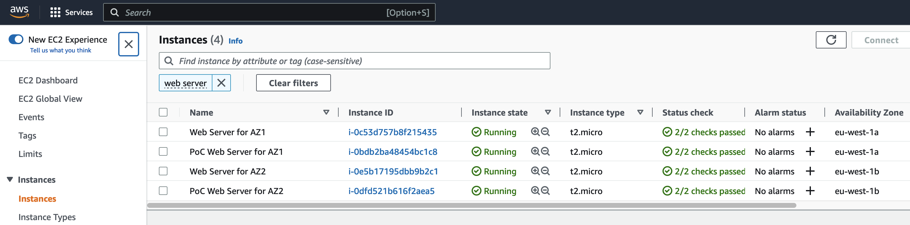
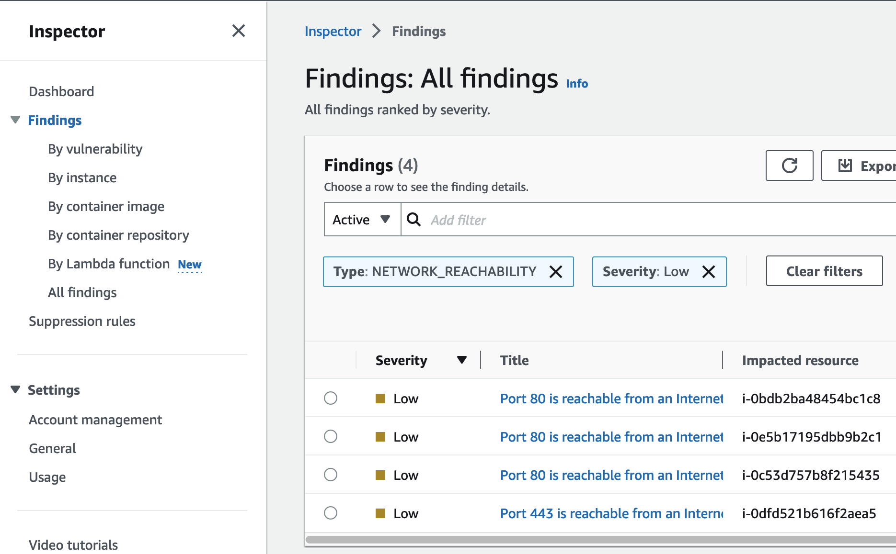
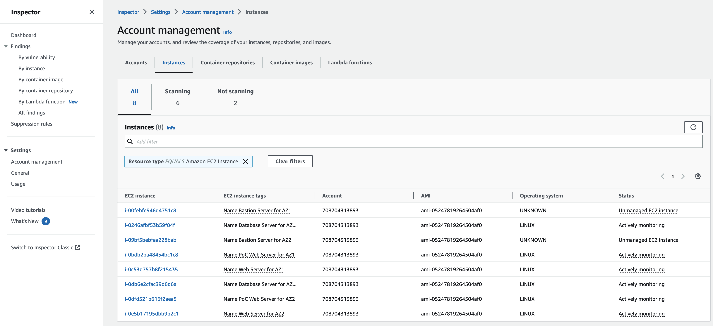
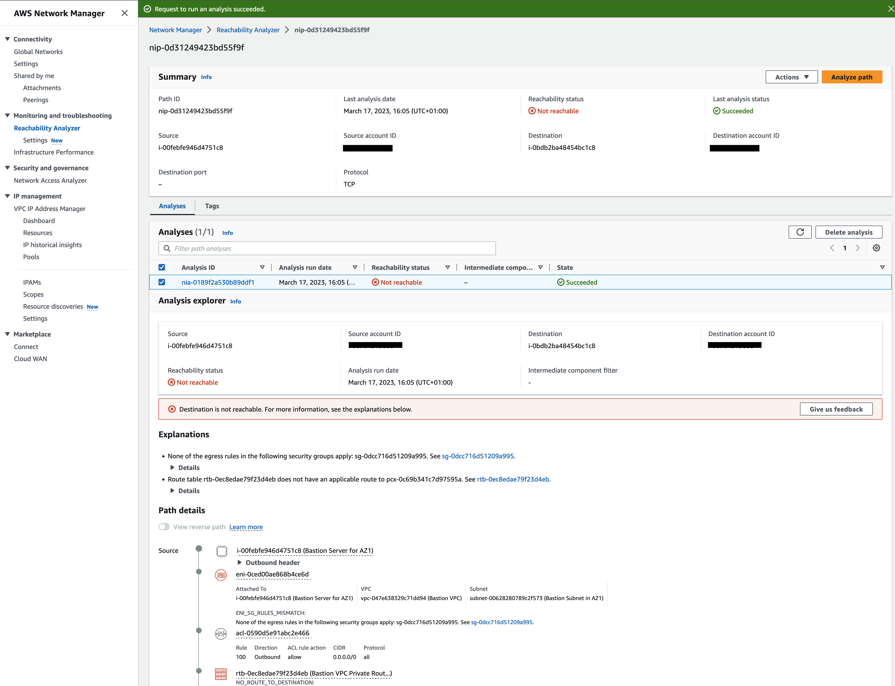

Module 3 - Evaluating Findings
==============================

In the previous module you activated Amazon Inspector. In this module you will evaluate the various findings generated by Inspector and identify potential mitigations. You will use these findings to evaluate the assumptions discussed in the start of the workshop. For reference they are:

__Assumption 1.__ Instances in private subnets are not accessible from the internet

__Assumption 2.__ Putting servers in different Availability zones provides both failover and better reliability

<!-- __Assumption 3.__ Nothing can route through the bastion VPC -->

__Assumption 3.__ Access to the servers is limited according to the principle of least privilege

__Assumption 4.__ The bastion hosts can access all environments

Evaluating the Inspector Findings
========================================

Let's look at the Inspector Network Reachability findings and see what we can learn.

1.  Go back to the Inspector console and select Findings from the navigation bar on the left.

2.  Click on the _Add Filter_ input field and filter for _Type_ of _NETWORK_REACHABILITY_

	

	<!-- !!! info "Inspector Agent delay"
		If you see multiple Medium findings and none of the findings indicate the Inspector agent was running, you will need to delete the Assessment and run it again. This means the instances did not have the Inspector agent running at the time of the scan. The agent is installed, it may just have been coming active. -->

	To begin, you will start evaluating the higher severity findings. So let’s take a look at a Medium finding first.

3.  Select the first Medium finding starting with _Port 22 is reachable..._ by clicking the checkbox to the left of _Medium_

	

	Our instance is reachable via SSH from the Internet. First, let's find out which instance that is. Click on the link for the Resource ID under _Resource affected_. Looking at the name this is our PoC Web Server in AZ2. We should not expose this via port 22 to the Internet. 
	
4.  How to remediate? Inspector tells us at the bottom under _Remediation_ that we can restrict the access to our instance via the Security Group or Access Control List.

	In the _Open Network Paths_ section click on _Security Group_ and copy the Security Group ID. Next switch to [Security Groups](https://eu-west-1.console.aws.amazon.com/ec2/v2/home?region=eu-west-1#SecurityGroups:) and enter the id in the search bar.
	
	Click on the _Inbound rules_ which reveals that port 22 for SSH is open to the world. That means _Assumption 3. Access to the servers is limited according to the principle of least privilege_ is wrong. This is something you would want addressed first.

	So since you know some things are wrong, let’s check the other findings for this server. You do that by filtering by the instance ID.

5.  Go back to Inspector and in the Findings view add another filter for _Resource ID_ that equals your instance id (you can copy the instance id from the first finding).
	
	There's another finding for our WebServer instance indicating that port 443 is exposed to the internet. Given we are serving a website and this is a HTTPS port the severity is low. We could put the WebServers into private subnets and only expose the LoadBalancer into the public subnet, but let's focus on understanding the other findings as well.

6.  Going back to the Medium finding with port 22 being exposed to the internet let us check if other instances are affected by this as well. In the Findings view remove the filter for the instance id. Add a new filter for _Open port_ from _22_ to _22_.

	As we can see luckily only our WebServer for AZ2 is affected.

7.  Remove the filter for the _Resource ID_ and let's have a look at the other _Medium_ findings. As we can see there are 2 instances with port 3306 reachable from the internet. Click on one of these findings and follow the link to the affected resource. As it turns out this is one of our database servers. Looking at the second finding with port 3306 being reachable from the internet shows that actually both our database servers are impacted by this. This is for sure a security concern, databases should reside in private subnets and not being accessible from the internet. So _Assumption 1. Instances in private subnets are not accessible from the internet_ is broken as well. If the subnet would have been setup correctly (meaning no route to an Internet Gateway in the respective RouteTable) the assumption would have been correct.

8. As we looked at all the Medium findings let us now investigate the others with low severity. You can add another filter for severity low.
	
   We already looked at the finding with port 443. However, somethings seems odd about the number of findings here. We have 4 WebServers in total, 2 in prod and 2 for our PoC. On the other hand we have 3 findings for Port 80 and one for port 443 being exposed to the internet.

9. Go to the EC2 console and filter for _Web Server_ or simply click [this link](https://eu-west-1.console.aws.amazon.com/ec2/v2/home?region=eu-west-1#Instances:search=:web%20server;v=3;$case=tags:true%5C,client:false;$regex=tags:false%5C,client:false). Have a look at the _Availability Zone_ column. We see that we have one instance of Web Server and PoC Web Server per AZ (here _eu-west-1a_ and _eu-west-1b_, yours might differ).  So _Assumption 2. Putting servers in different Availability zones provides both failover and better reliability_ seems to be valid. Is it? If there should be an event in one AZ and we want to fail over the instances have to listen on the same ports to make this work. 

10. Let's go back to the Findings view of Inspector, filtering for severity low. Three instances are listening on port 80, one on port 443 (all instances ids in column _Impacted resource_ are different for this filter).  Therefor an failover to our _PoC Web Server for AZ2_ would fail, breaking assumption 2.

11. Now what about _Assumption 4. The bastion hosts can access all environments_? Here we come back to our instance coverage of only 75%. In Inspector go to the [dashboard](https://eu-west-1.console.aws.amazon.com/inspector/v2/home?region=eu-west-1#/dashboard) and click on the blue 75%. The status column reveals that both of our Bastion hosts are unmanaged, meaning they are not scanned by Inspector. At this point we do not dive into why that is and how to fix it. We take it as a learning that there might be resources that we did not configure in a way to be included in the scans of Inspector. So in order to verify assumption 4 we will use a different tool.

12. You might have seen the blue banner in step 4, where we investigated a security group. It tells that we can check network connectivity with the Reachability Analyzer which is part of the AWS Network Manager. Let's [pay it a visit](https://eu-west-1.console.aws.amazon.com/networkinsights/home?region=eu-west-1#ReachabilityAnalyzer).

13. Let us check if there is connectivity from _Bastion Server for AZ1_ to the _Database Server for AZ1_. Click on _Create and analyze path_. As _Source type_ select _instances_ and _Bastion Server for AZ1_. As _Destination type_ select _instances_ and _Database Server for AZ1_. Leave the rest as it is and click on _Create and anapyze path_. The analyzsis will take a couple of seconds.

14. You should get a success for reachability, meaning both instances can connect. Repeat step 13, this time with _Source type_ of _Bastion Server for AZ1_ and destination as _PoC Web Server for AZ1_

15. This team Reachability Analyzer tells us that _PoC Web Server for AZ1_ is not reachable from _Bastion Server for AZ1_.  We could even look into the path details to find out the root cause of that connectivity failing. However, at this point let us conclude that _Assumption 4. The bastion hosts can access all environments_ is proven wrong as well.

<!-- 4.  Highlight the AWS agent ID, copy it, and scroll back to the top to paste the Instance ID of the offending instance in the “Filter”

	

	Hover over the finding titles with your mouse. You will immediately see multiple findings about Peered connections, one Low and the top three Informational findings. Since you already looked at the SSH finding and know you need to address that, let’s look at the Informational finding for this peered connection. -->

<!-- 5.  Expand the “Finding” Column so you can see enough of the title to see “Peered”

6.  Expand the Informational finding that starts with “Aggregate network exposure” and has “Peered”

	

7.	Check what VPC is peered. Click on the VPC Peering Connection link in the finding to open it in a new window. Note the peer name.

8.	Click on the VPC peer name from the finding.

9.	Click on the Requester VPC in the bottom window.

	Here you see the peer is to the Bastion VPC. This is okay because you expect this behavior. What you don’t see, however, is anything about connectivity from the WebApp VPC. That’s because the report knows there’s no way to transit through multiple VPC Peering connections today. So this helps you validate Assumption 3 is true as long as there’s no additional routing the report can’t see (for example a Cisco CSR Transit VPC). But this also means Assumption 5 is false because there is no Peer between the Bastion VPC and the Proof of Concept.

	What about the multiple Availability Zone configuration though for this Proof of Concept? Given the misconfiguration, you should check Assumption 2. Since you want to check against multiple Instances, let’s filter by VPC, in this case the PoCVPC. -->

<!-- 10.  Close the preview window and go back to the findings. Scroll back to the top and put the VPC ID of the offending instance in the “Filter”. Collapse the first finding you had open.

	

	Next, you want to compare the Internet reachability. The most relevant findings related to internet access are the “Aggregate network exposure” findings. Those are found half way down the list. Comparing them visually you will see one instance only has port 80 open. 

11.  Expand the first finding that starts with “Aggregate network exposure” and has “internet”.

	

12.  Notice only port 80 is open. Collapse this finding.

13.  Expand the second finding that starts with “Aggregate network exposure” and has “internet” – it will have a different instance ID.

	

	Here you see the other instance has ports 22 and 443 open.

	This would indicate than in a failover scenario the second instance would fail to respond to any HTTP traffic. So this must be fixed for failover to work. Assumption 2 is proven false.

	The remaining assumption, Assumption 1, related to the Private Subnets, so let's move on from the POC Server side. You have a couple of things you need to address so can send this report to the developer to have them fix things. Let’s start looking at the WebApp side. Notice the route table for the Database subnet is incorrect, so let’s see if that is having any security impact. Again you can filter by the instance ID, or something you expect to see in the finding. For example, let’s filter by the port number: 3306. -->

<!-- 14.  Collapse the open findings. Scroll back to the top and put “3306” in the “Filter”

	

	Here you are looking for instances open to the internet on this port. One of the first findings indicate the instance has ports are reachable from the internet.

15.  Expand the finding that starts with “Aggregate network exposure” and has “internet”

	

	From the naming context you know this is wrong since this instance shouldn't have access from the internet. But rather than following this one recommendation, you can also to apply a different route table to the subnet. This just shows how there are different ways to solve the same problem, but it requires context. This is a good example where defense in depth is important. You may have set the Security Group to 0.0.0.0/0 for testing or internal access purposes, but because of a bad assumption you potentially put your entire environment at risk.

	In the end this proves Assumption 1 was false and needs to be revisited for all servers.

!!! info "Alternative methods of analysis"
		There’s another way to compare instance findings like this. You can download all of these findings in a .csv file, allowing you to sort, filter, and compare much more programmatically. We choose not to do this to provide a consistent experience for all participants. -->

Take Aways
=========

Thanks to the Inspector and Reachability Analyzer you were able to show that all of our assumptions had problems due to misconfigurations.

But now what? You don't want to leave these issues as they are, so let's see how to remediate them by combining other AWS tools and services. [Integration and Remediation](04-integration-and-remediation.md) will do just that.
