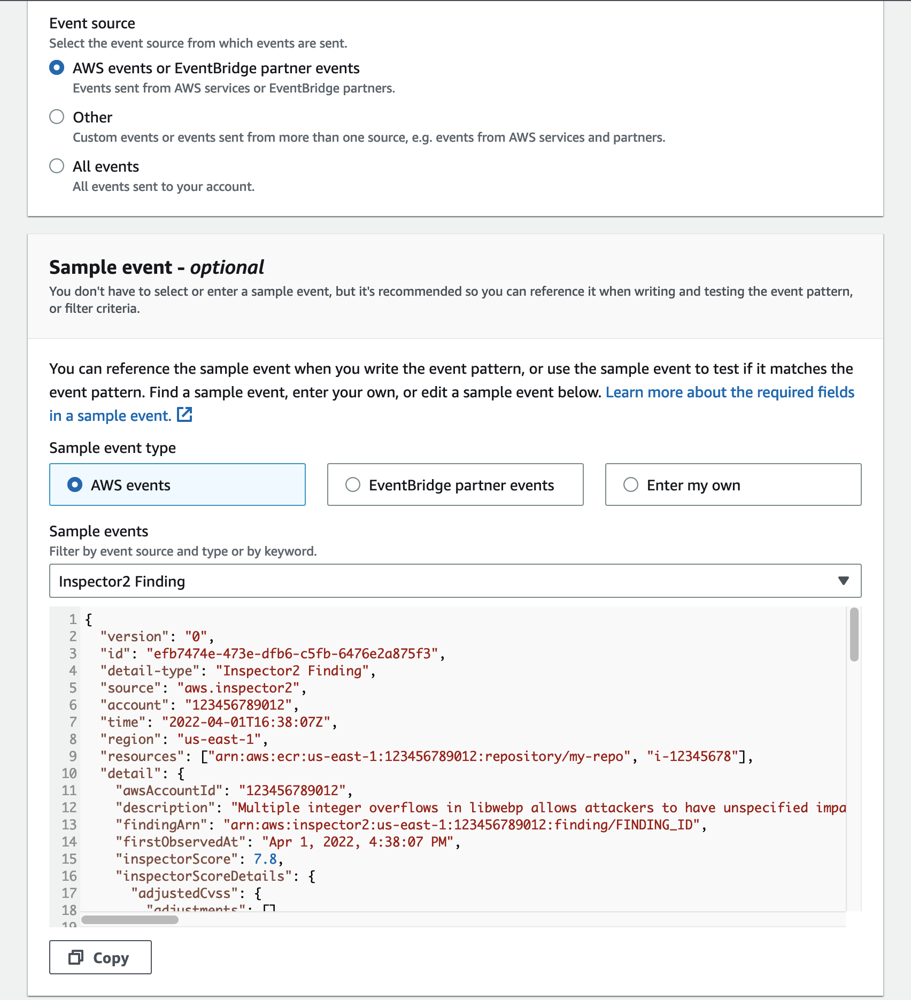
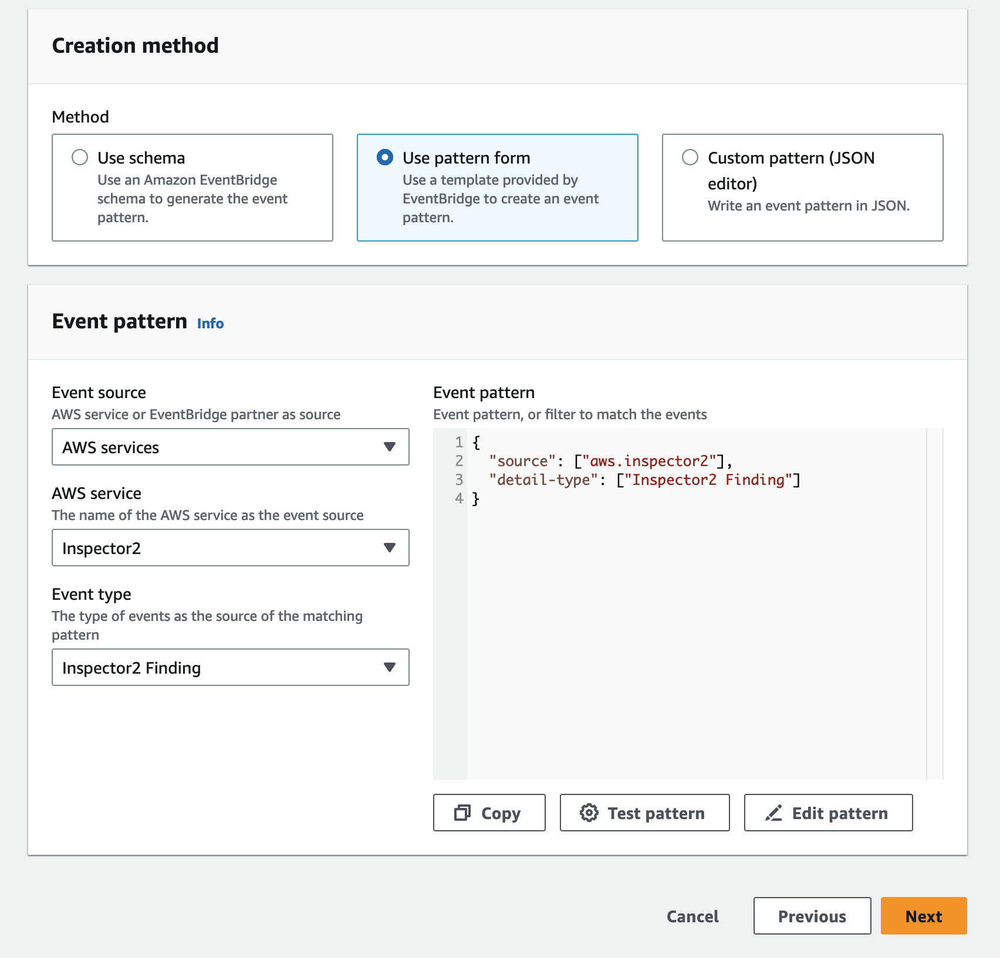
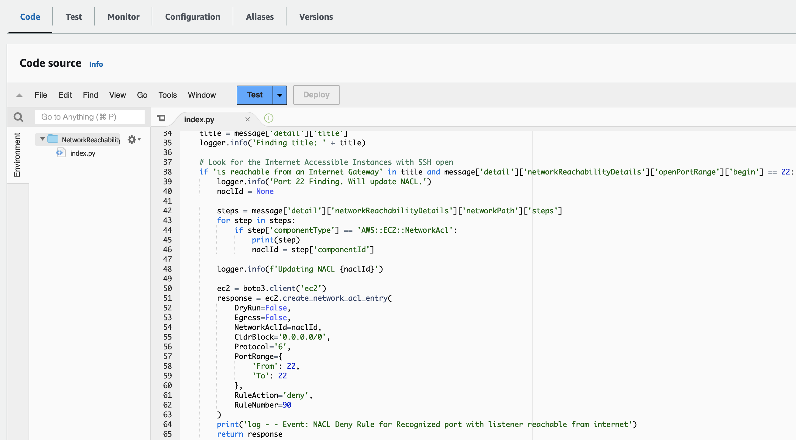

Module 4 - Integration and Remediation
======================================

<!-- In the previous module you identified issues with the network configuration. It's good to have those identified, but we should also remediate them. In this module you will do a manual remediation but also leverage additional AWS services to deploy automatic remediations to known bad configurations.  -->

In the previous module you identified issues with the network configuration. It's good to have those identified, but we should also remediate them. In this module you will leverage additional AWS services to deploy automatic remediations to known bad configurations. 


Integrating Inspector with other AWS Security Services
======================================================

In order to implement automatic remediation for specific findings we need a trigger for new findings coming in. We will create a rule within Amazon EventBridge which is a service that provides real-time access to changes in data in AWS services, your own applications, and software as a service (SaaS) applications without writing code. Then you are going to use that to trigger a Lambda function to remediate one of the most critical findings we found. The CloudFormation template has deployed a Lambda function to block SSH access to misconfigured instances. Let's build the connection from EventBridge to Lambda and review the code.

1.	Go to the [Amazon EventBridge console](https://eu-west-1.console.aws.amazon.com/events/home?region=eu-west-1#/)

2.	Click on _Rules_ on the left hand side and then on the button named _Create rule_

3.	Name the rule _InspectorAutomation_. Leave everything else as default and click on _Next_.

4.	Scroll down to _Sample Event_, go into the Dropdown and select _Inspector2 Finding_. Have a look at the sample event to understand the structure of such an event that EventBridge would send to our Lambda function when Inspector detects a new finding. We will parse this structure within our Lambda function.

	

5.	Scroll down to the _Event pattern_ section. Here select _Inspector2_ as _AWS service_ and _Inspector2 Finding_ as _Event type_.

	

6.	Click _Next_, then on _target_ drop down select _Lambda function_ and the _NetworkReachabilityDemo-remediation-nacl_ function.

7.	Click _Next_ until your end up in the _Review and create_ screen. Review the rule definition and finally click on _Create rule_.

	We've now configured EventBridge to send any findings it receives to our Lambda function. Our Lambda function is configured to only respond to specific findings in specific ways. If you're interested in reviewing the Lambda function you can go to the Lambda console. The relevant piece of code for this activity are shown below:

	

	You can see here that the Lambda code adds a Network ACL line that blocks SSH from the internet to any instance that has SSH open to the internet.

	To trigger this you need to have Inspector submit a finding to EventBridge. Rather than waiting for Inspector to finish an assessment though, you can simulate this action.

9.	Go into the Lambda console and select the function [_NetworkReachabilityDemo-remediation-nacl_](https://eu-west-1.console.aws.amazon.com/lambda/home?region=eu-west-1#/functions/NetworkReachabilityDemo-remediation-nacl?tab=code). Click on the tab named _Test_. Select _Create new event_. This allows us to define an event that we want to test our Lambda function against. We will leverage our knowledge about the structure of a finding that Inspector sends via EventBridge.

10. Let us remediate the SSH finding (including future SSH findings) as this is a critical one. Provide an _Event name_ and copy the following JSON into the _Event JSON_ textbox.

```
{
  "version": "0",
  "id": "c02b4335-53a3-ecf7-b4c8-0a9ffc19a8ec",
  "detail-type": "Inspector2 Finding",
  "source": "aws.inspector2",
  "account": "708704313893",
  "time": "2023-03-20T18:08:05Z",
  "region": "eu-west-1",
  "resources": [
    "i-0cc555cfcdf60a48f"
  ],
  "detail": {
    "awsAccountId": "708704313893",
    "description": "On the instance i-0cc555cfcdf60a48f, the port range 22-22 is reachable from the InternetGateway igw-0164390e83f9a0f6b from an attached ENI eni-07db2a50cfa018a03.",
    "findingArn": "arn:aws:inspector2:eu-west-1:708704313893:finding/9abc5f3a76093eeb2ad420fdf9c011ab",
    "firstObservedAt": "Mar 20, 2023, 6:08:05 PM",
    "lastObservedAt": "Mar 20, 2023, 6:08:05 PM",
    "networkReachabilityDetails": {
      "networkPath": {
        "steps": [
          {
            "componentId": "igw-0164390e83f9a0f6b",
            "componentType": "AWS::EC2::InternetGateway"
          },
          {
            "componentId": "INSERT YOUR ACL ID HERE",
            "componentType": "AWS::EC2::NetworkAcl"
          },
          {
            "componentId": "sg-0f615897558ace817",
            "componentType": "AWS::EC2::SecurityGroup"
          },
          {
            "componentId": "eni-07db2a50cfa018a03",
            "componentType": "AWS::EC2::NetworkInterface"
          },
          {
            "componentId": "i-0cc555cfcdf60a48f",
            "componentType": "AWS::EC2::Instance"
          }
        ]
      },
      "openPortRange": {
        "begin": 22,
        "end": 22
      },
      "protocol": "TCP"
    },
    "remediation": {
      "recommendation": {
        "text": "You can restrict access to your instance by modifying the Security Groups or ACLs in the network path."
      }
    },
    "resources": [
      {
        "details": {
          "awsEc2Instance": {
            "iamInstanceProfileArn": "arn:aws:iam::708704313893:instance-profile/SharedServerConnectivityProfile",
            "imageId": "ami-05247819264504af0",
            "ipV4Addresses": [
              "34.245.90.167",
              "10.0.2.148"
            ],
            "ipV6Addresses": [],
            "keyName": "grey",
            "launchedAt": "Mar 20, 2023, 3:25:03 PM",
            "platform": "AMAZON_LINUX_2",
            "subnetId": "subnet-07d7d49356afcf27b",
            "type": "t2.micro",
            "vpcId": "vpc-07462a62acd48e298"
          }
        },
        "id": "i-0cc555cfcdf60a48f",
        "partition": "aws",
        "region": "eu-west-1",
        "tags": {
          "NetworkReachabilityDemo": "True",
          "aws:cloudformation:stack-name": "network-reachability-workshop",
          "aws:cloudformation:stack-id": "arn:aws:cloudformation:eu-west-1:708704313893:stack/network-reachability-workshop/fe6c0e20-c732-11ed-8a8d-064a414836bb",
          "aws:cloudformation:logical-id": "DbServerAZ1",
          "Name": "Database Server for AZ1"
        },
        "type": "AWS_EC2_INSTANCE"
      }
    ],
    "severity": "MEDIUM",
    "status": "ACTIVE",
    "title": "Port 22 is reachable from an Internet Gateway - TCP",
    "type": "NETWORK_REACHABILITY",
    "updatedAt": "Mar 20, 2023, 6:08:05 PM"
  }
}
```

11.	The code snippet above contains a section with _INSERT YOUR ACL ID HERE_. You need to replace this placeholder with the ID of the Network Access Control List that the SSH finding correlates to.

12. Go back into Inspector

	

	Using the ARN you copied down in Step 3 of Module 3 you are going to publish a fake SNS message using the appropriate ARN to kick off the Lambda function.

	!!! info "What ARN?"
		If you don't have the ARN, you can go back to Inspector and copy the ARN from the Medium finding.

12.	Paste the ARN into the appropriate place in the following text: {replace the "**INSERT ARN HERE**" with your arn)

	``` 
	{"template":"arn:aws:inspector:us-east-1:123456789012:target/0-a12b3c4d/template/0-5e6f7g8h","run":"arn:aws:inspector:us-east-1:123456789012:target/0-a12b3c4d/template/0-5e6f7g8h/run/0-9i0j1k2l","time":"2019-04-09T00:00:01.401Z","finding":"INSERT ARN HERE","event":"FINDING_REPORTED","target":"arn:aws:inspector:us-east-1:123456789012:target/0-a12b3c4d"}
	```

13.	Paste the SNS message from above in the "Message body to send to the endpoint" text box

14.	Leave all the other fields empty

	

15.	Click "Publish Message"

	!!! info "If you're bored"
		<p style="font-size:16px;">
		Alternatively if you have the time, you can re-run the Inspector report and watch once it's complete to see if the change was made.
		</p>

	To confirm that it worked you will check the Network ACL's.

16.	Click on Services on the top right and click on VPC

17.	On the left hand navigation click on Network ACLs

	

18.	Since the Proof of Concept VPC is the one with the misconfiguration, click on the ACL associated with that VPC

	

19.	On the bottom navigation, click on "Inbound Rules"

	

	Do you see a rule blocking SSH?

	But if SSH is completely blocked to the instance, how can legitimate administrators configure the machine? Well, they can modify the Security Group and then the NACL through their Change Process. But if they want to make sure the instance wasn't compromised there's another option.

20.	Click on Services on the top right and click on Systems Manager

21.	On the left hand navigation, click on Session Manager

	

22.	On the right hand side click on Start Session

	

	Do you remember the instance ID with the misconfigured Security Group? If not, don't worry, it was the PoC Web Server for AZ2

23.	Click on the radio button next to the instance

24.	Click Start Session

	

25.	Type "ping 8.8.8.8" - Are you able to ping out to the world? Hit Cntl-C when you're ready to move on.

26. Type "whoami" - What user are you logged into the box as?

	

	This looks just like an SSH session! Instead though, this is a proxy created by the AWS System Manager Agent installed on the AMI. With the AWS Systems Manager Session Manager feature you can create an SSH-like access to devices that don't have port 22 open at all. All that's necessary is to allow traffic to the Systems Manager Endpoint over port 443 and return traffic.

27.	When you're done, hit "Terminate" in the top right corner

28.	Confirm you want to terminate the session.

So now we've learned how you can use Inspector to kick off a Lambda function and automatically remediate potentially risks configurations. Additionally, you've seen how when you isolate instances from the world, you can still use AWS services to securely access them and perform troubleshooting or incidence response.

!!! Attention
	<p style="font-size:16px;">
	Now since there are some instances still open to the internet and potentially vulnerable, let's clean up what's been built.
	</p>

[Cleanup](05-cleanup.md)
