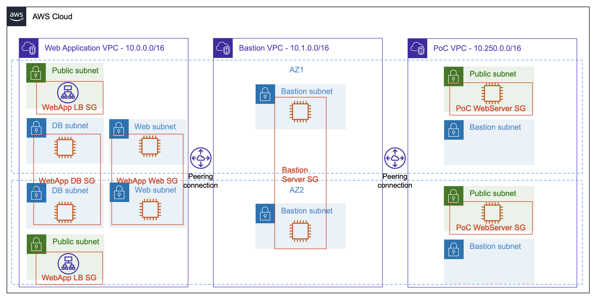

Overview
========

In this workshop you will learn how to use the Amazon Inspector Network Reachability report to validate your network configuration without needing a deep background in networking. You will use this report to find misconfigurations that may result in unintended behaviors and unexpected vulnerabilities. You will finish the workshop by remediating these vulnerabilities by integrating the findings of Amazon Inspector with other AWS services.

-	*Level*: Intermediate

-	*Duration*: 1:30 - 2:00 hours

-	*[CSF Functions](https://www.nist.gov/cyberframework/online-learning/components-framework)*: Detect, Respond

-	*[CAF Components](https://docs.aws.amazon.com/prescriptive-guidance/latest/security-reference-architecture/foundations.html)*: Detective, Responsive

Prerequisites
=============

1.	You will need an AWS account for this workshop and administrative credentials.
2.	You should be familiar with AWS core services such as Amazon EC2, Amazon VPC, and AWS CloudFormation. You should also be comfortable using the AWS console.
3.	Run this workshop in the *eu-west-1* region.
4.	You must have an [EC2 key pair](<https://docs.aws.amazon.com/AWSEC2/latest/UserGuide/ec2-key-pairs.html#having-ec2-create-your-key-pair>) in the region *eu-west-1*. Create one in the [AWS management console](https://eu-west-1.console.aws.amazon.com/ec2/home?region=eu-west-1#KeyPairs:) and download it to your computer.
<!-- 3.	The instructions are written with the understanding that the account is new or clean. We strongly recommend that you do not do these workshops in work or "production" accounts. -->
<!-- 4.	You will incur charges for the AWS resources used in this workshop.   The charges for some of the resources may be covered through the [AWS Free Tier](https://aws.amazon.com/free/).  The demo uses free tier choices wherever possible. -->
<!-- 5.	If you are using an existing account with resources already deployed in a region, be aware of the soft limit of five VPCs per region. -->

Workshop Scenario
=================

Example Corp. has been in AWS for a few months and is moving its first few workloads into AWS. The first workload to move was an external website with a database back end. Example Corp.’s security team insisted administrative access to servers must be through a set of bastion hosts in a separate VPC. Recently, a developer has created a public proof of concept for a new highly available web service and connected it to the environment without going through all the proper change management. The various IT stakeholders have been working off the following untested assumptions:

__Assumption 1.__ Instances in private subnets are not accessible from the internet

__Assumption 2.__ Putting servers in different Availability zones provides both failover and better reliability

<!-- __Assumption 3.__ Nothing can route through the bastion VPC -->

__Assumption 3.__ Access to the servers is limited according to the principle of least privilege

__Assumption 4.__ The bastion hosts can access all environments

Example Corp's IT team found the new configuration not because of controls, but from the increase in their AWS bill. As a result, the security and operations teams want to validate the right security is applied to both the new and existing environments using the Inspector Network Reachability report.

Architecture
============

You will use AWS CloudFormation to build the environment

The CloudFormation template will build the following elements of the workshop in a single account and will not use any existing VPCs.

* Three VPCs - VPC 1, 2, and 3.  VPC 1 and VPC 2 are both peered to VPC 3.
* VPC 1 (the Web Application VPC) spans two Availability Zones each of which contains one public subnet and two private subnets.  The VPC also includes Application Load Balancers, web servers, and database servers.
* VPC 2 (the Proof of Concept VPC) spans two Availability Zones each of which contains one public subnet and one private subnet.  The VPC also includes two servers.
* VPC 3 (the Bastion VPC) spans two Availability Zones each of which has one private subnet.  The VPC also contains two bastion servers that offer SSH and RDP access to the environment.

This environment is shown below.

Here are the Route Tables and Security Groups for you to review as well. Don't worry, we will also cover this with a short presentation in a bit.

<!-- Presentation Deck
=================

Feel free to download the [workshop presentation](./assets/demo-support-presentation.pdf). You may find this helpful when doing the workshop yourself or in support of a group learning activity.

This site will note where the presentation material may be most useful. -->

Region
======

Please use the *eu-west-1* region.

Modules
=======

The workshop is broken up into the five modules below - please start with the [first module](01-environment-setup.md):

1.	[Environment Build and Configuration](01-environment-setup.md)
2.	[Running Inspector](02-running-inspector.md)
3.	[Evaluating Findings](03-evaluate-findings.md)
4.	[Integration and Remediation](04-integration-and-remediation.md)
5.	[Cleanup](05-cleanup.md)
